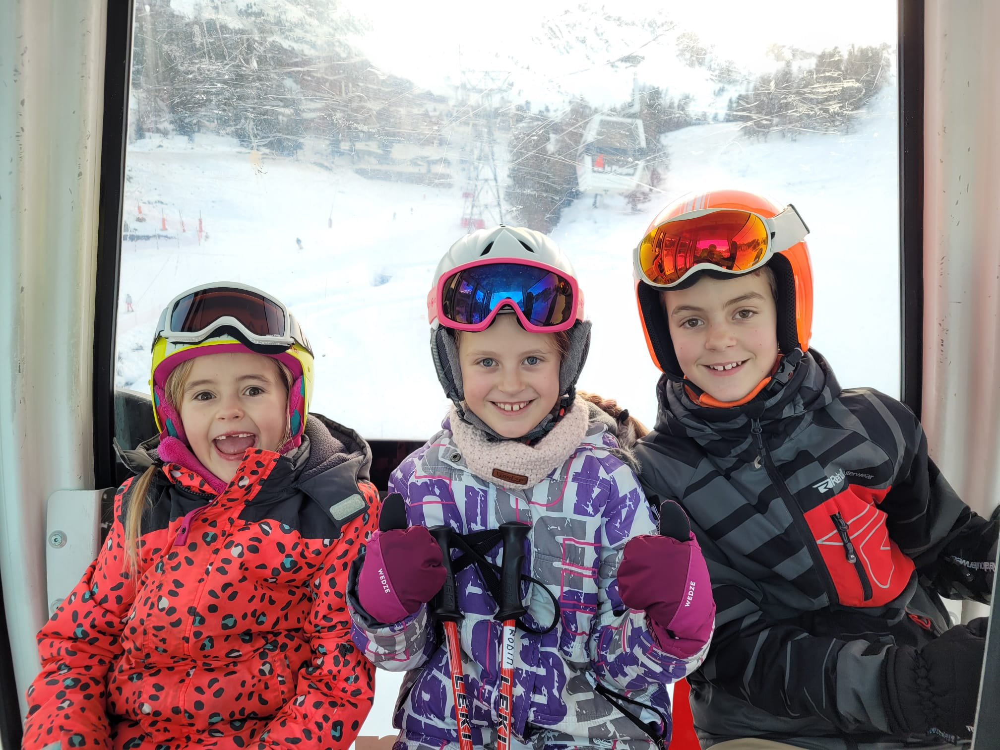
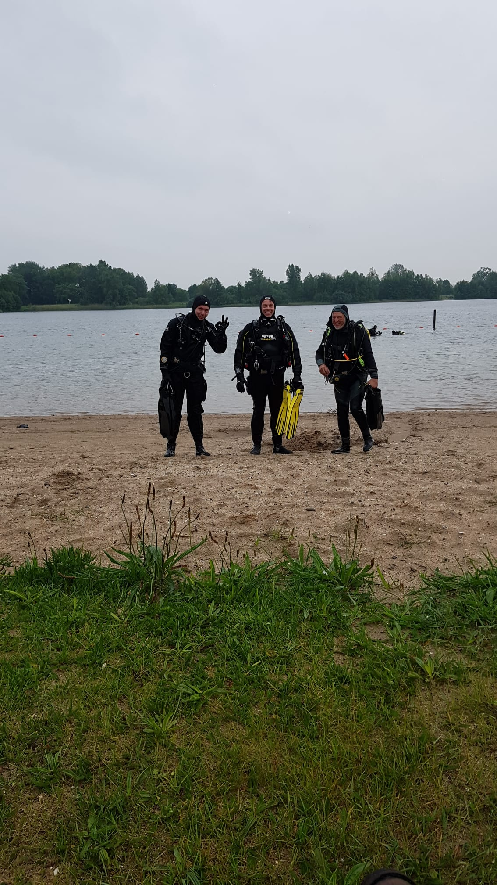
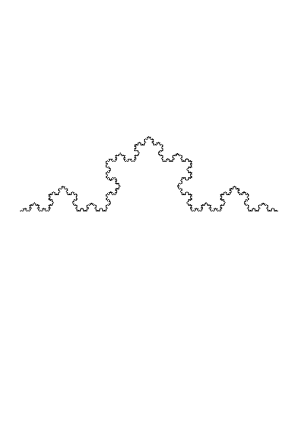

layout: true
class: middle, center

---
name: nature
# Nature of ~~Code~~ Storytelling

---
name: story
class: story

# Once Upon a Time...

---

---
<!-- Sun behind cloud  -->

# &#9925;

---
<!-- Mirror -->

# &#129694;

---
<!-- Listening -->
# &#128066;

---
<!-- Reading -->

# &#128218;

---
<!-- Thinking -->

# &#129300;

---
<!-- Rainbow -->

# &#127752;

---
<!-- Time -->

# &#128337; &#63;

---
<!-- Rat Race -->

# &#128000; &#127937;

---
<!-- Searching Sparkles -->

# &#128270; &#10024;

---
<!-- Meditate -->

# &#129496;

---
<!-- Smell Roses -->

# &#128067; &#127801;

---
<!-- Shock Party -->

# &#128561; &#129395;

---
<!-- Map  Compass -->

# &#128506; &#129517;

---
name: introduction
background-image: url(https://fifth-postulate.nl/image/me.jpg)
background-position: center

---
template: introduction

.image.wide[]

---
template: introduction

.image.wide[]

---
template: introduction

.image.tall[]

---
template: introduction

.image.tall[]

---
template: introduction

.image.wide[]

---
template: introduction

.image.tall[]

---
template: introduction

.image.wide[]

---
template: introduction

.image.wide[]

---
template: introduction

.image.tall[]

---
template: introduction

<textarea rows="9" cols="74" wrap="off">
  /\            /\      /\            /\      /\            /\      /\                /\      /\                /\      /\/\    /\/\    /\/\    /\/\    /\/\        /\    /\    /\    /\    /\            /\    /\/\            /\    /\/\            /\    /\/\            /\    /\/\            /\    /\/\      /\                                                                                                                        /\      /\/\        /\            /\    /\/\      /\                                /\      /\/\        /\            /\    /\/\        /\                /\      /\/\        /\            /\    /\/\      /\                                                                                                                                                                                                                                                                                /\      /\/\          /\            /\    /\/\      /\            /\      /\            /\      /\                /\      /\/\    /\/\    /\/\          /\    /\    /\            /\    /\/\            /\    /\/\            /\    /\/\      /\            /\      /\                                                                        /\      /\/\    /\/\        /\    /\            /\    /\/\            /\    /\/\      /\                /\      /\                /\      /\                        /\      /\/\    /\/\    /\/\        /\    /\    /\            /\    /\/\            /\    /\/\            /\    /\/\        /\            /\      /\            /\      /\/\    /\/\        /\    /\            /\    /\/\            /\    /\/\            /\                /\      /\                        /\      /\/\    /\/\          /\    /\            /\    /\/\            /\    /\/\      /\                                                        /\      /\/\        /\            /\    /\/\      /\                                                                                                                                                                                                /\      /\/\          /\            /\    /\/\      /\            /\      /\            /\      /\                                                /\      /\/\    /\/\    /\/\        /\    /\    /\            /\    /\/\            /\    /\/\            /\    /\/\              /\            /\      /\            /\      /\            /\      /\/\    /\/\    /\/\          /\    /\    /\            /\    /\/\            /\    /\/\            /\    /\/\      /\                /\      /\                                                                                                /\      /\/\    /\/\          /\    /\            /\    /\/\            /\    /\/\    
 /  \  /\  /\  /  \/\  /  \  /\  /\  /  \/\  /  \  /\  /\  /  \/\  /  \  /\  /\  /\  /  \/\  /  \  /\  /\  /\  /  \/\  /    \  /    \  /    \  /    \  /    \  /\  /  \  /  \  /  \  /  \  /  \  /\/\  /\/  \  /    \  /\/\  /\/  \  /    \  /\/\  /\/  \  /    \  /\/\  /\/  \  /    \  /\/\  /\/  \  /    \    /  \  /\  /\  /\  /\  /\  /\  /\  /\  /\  /\  /\  /\  /\  /\  /\  /\  /\  /\  /\  /\  /\  /\  /\  /\  /\  /\  /\  /\  /\  /  \/\  /    \  /\  /  \  /\/\  /\/  \  /    \    /  \  /\  /\  /\  /\  /\  /\  /\  /  \/\  /    \  /\  /  \  /\/\  /\/  \  /    \      /  \  /\  /\  /\  /  \/\  /    \  /\  /  \  /\/\  /\/  \  /    \    /  \  /\  /\  /\  /\  /\  /\  /\  /\  /\  /\  /\  /\  /\  /\  /\  /\  /\  /\  /\  /\  /\  /\  /\  /\  /\  /\  /\  /\  /\  /\  /\  /\  /\  /\  /\  /\  /\  /\  /\  /\  /\  /\  /\  /\  /\  /\  /\  /\  /\  /\  /\  /\  /\  /\  /\  /\  /\  /\  /\  /\  /\  /\  /\  /\  /\  /\  /\  /  \/\  /    \  /\/\  /  \  /\/\  /\/  \  /    \    /  \  /\  /\  /  \/\  /  \  /\  /\  /  \/\  /  \  /\  /\  /\  /  \/\  /    \  /    \  /    \  /\/\  /  \  /  \  /  \  /\/\  /\/  \  /    \  /\/\  /\/  \  /    \  /\/\  /\/  \  /    \    /  \  /\  /\  /  \/\  /  \  /\  /\  /\  /\  /\  /\  /\  /\  /\  /\  /\  /\  /\  /\  /\  /\  /\  /  \/\  /    \  /    \  /\  /  \  /  \  /\/\  /\/  \  /    \  /\/\  /\/  \  /    \    /  \  /\  /\  /\  /  \/\  /  \  /\  /\  /\  /  \/\  /  \  /\  /\  /\  /\  /\  /  \/\  /    \  /    \  /    \  /\  /  \  /  \  /  \  /\/\  /\/  \  /    \  /\/\  /\/  \  /    \  /\/\  /\/  \  /    \      /  \  /\  /\  /  \/\  /  \  /\  /\  /  \/\  /    \  /    \  /\  /  \  /  \  /\/\  /\/  \  /    \  /\/\  /\/  \  /    \    /\    /  \  /\  /\  /\  /  \/\  /  \  /\  /\  /\  /\  /\  /  \/\  /    \  /    \  /\/\  /  \  /  \  /\/\  /\/  \  /    \  /\/\  /\/  \  /    \    /  \  /\  /\  /\  /\  /\  /\  /\  /\  /\  /\  /\  /\  /\  /  \/\  /    \  /\  /  \  /\/\  /\/  \  /    \    /  \  /\  /\  /\  /\  /\  /\  /\  /\  /\  /\  /\  /\  /\  /\  /\  /\  /\  /\  /\  /\  /\  /\  /\  /\  /\  /\  /\  /\  /\  /\  /\  /\  /\  /\  /\  /\  /\  /\  /\  /\  /\  /\  /\  /\  /\  /\  /\  /  \/\  /    \  /\/\  /  \  /\/\  /\/  \  /    \    /  \  /\  /\  /  \/\  /  \  /\  /\  /  \/\  /  \  /\  /\  /\  /\  /\  /\  /\  /\  /\  /\  /\  /  \/\  /    \  /    \  /    \  /\  /  \  /  \  /  \  /\/\  /\/  \  /    \  /\/\  /\/  \  /    \  /\/\  /\/  \  /    \    /\/\    /  \  /\  /\  /  \/\  /  \  /\  /\  /  \/\  /  \  /\  /\  /  \/\  /    \  /    \  /    \  /\/\  /  \  /  \  /  \  /\/\  /\/  \  /    \  /\/\  /\/  \  /    \  /\/\  /\/  \  /    \    /  \  /\  /\  /\  /  \/\  /  \  /\  /\  /\  /\  /\  /\  /\  /\  /\  /\  /\  /\  /\  /\  /\  /\  /\  /\  /\  /\  /\  /\  /\  /  \/\  /    \  /    \  /\/\  /  \  /  \  /\/\  /\/  \  /    \  /\/\  /\/  \  /    \   
/    \/  \/  \/      \/    \/  \/  \/      \/    \/  \/  \/      \/    \/  \/  \/  \/      \/    \/  \/  \/  \/      \/      \/      \/      \/      \/      \/  \/    \/    \/    \/    \/    \/    \/      \/      \/    \/      \/      \/    \/      \/      \/    \/      \/      \/    \/      \/      \/\/    \/  \/  \/  \/  \/  \/  \/  \/  \/  \/  \/  \/  \/  \/  \/  \/  \/  \/  \/  \/  \/  \/  \/  \/  \/  \/  \/  \/  \/  \/      \/      \/  \/    \/    \/      \/      \/\/    \/  \/  \/  \/  \/  \/  \/  \/      \/      \/  \/    \/    \/      \/      \/\/\/    \/  \/  \/  \/      \/      \/  \/    \/    \/      \/      \/\/    \/  \/  \/  \/  \/  \/  \/  \/  \/  \/  \/  \/  \/  \/  \/  \/  \/  \/  \/  \/  \/  \/  \/  \/  \/  \/  \/  \/  \/  \/  \/  \/  \/  \/  \/  \/  \/  \/  \/  \/  \/  \/  \/  \/  \/  \/  \/  \/  \/  \/  \/  \/  \/  \/  \/  \/  \/  \/  \/  \/  \/  \/  \/  \/  \/  \/  \/  \/      \/      \/    \/    \/    \/      \/      \/\/    \/  \/  \/      \/    \/  \/  \/      \/    \/  \/  \/  \/      \/      \/      \/      \/    \/    \/    \/    \/    \/      \/      \/    \/      \/      \/    \/      \/      \/\/    \/  \/  \/      \/    \/  \/  \/  \/  \/  \/  \/  \/  \/  \/  \/  \/  \/  \/  \/  \/  \/  \/      \/      \/      \/  \/    \/    \/    \/      \/      \/    \/      \/      \/\/    \/  \/  \/  \/      \/    \/  \/  \/  \/      \/    \/  \/  \/  \/  \/  \/      \/      \/      \/      \/  \/    \/    \/    \/    \/      \/      \/    \/      \/      \/    \/      \/      \/\/\/    \/  \/  \/      \/    \/  \/  \/      \/      \/      \/  \/    \/    \/    \/      \/      \/    \/      \/      \/\/  \/\/    \/  \/  \/  \/      \/    \/  \/  \/  \/  \/  \/      \/      \/      \/    \/    \/    \/    \/      \/      \/    \/      \/      \/\/    \/  \/  \/  \/  \/  \/  \/  \/  \/  \/  \/  \/  \/  \/      \/      \/  \/    \/    \/      \/      \/\/    \/  \/  \/  \/  \/  \/  \/  \/  \/  \/  \/  \/  \/  \/  \/  \/  \/  \/  \/  \/  \/  \/  \/  \/  \/  \/  \/  \/  \/  \/  \/  \/  \/  \/  \/  \/  \/  \/  \/  \/  \/  \/  \/  \/  \/  \/  \/  \/      \/      \/    \/    \/    \/      \/      \/\/    \/  \/  \/      \/    \/  \/  \/      \/    \/  \/  \/  \/  \/  \/  \/  \/  \/  \/  \/  \/      \/      \/      \/      \/  \/    \/    \/    \/    \/      \/      \/    \/      \/      \/    \/      \/      \/\/    \/\/    \/  \/  \/      \/    \/  \/  \/      \/    \/  \/  \/      \/      \/      \/      \/    \/    \/    \/    \/    \/      \/      \/    \/      \/      \/    \/      \/      \/\/    \/  \/  \/  \/      \/    \/  \/  \/  \/  \/  \/  \/  \/  \/  \/  \/  \/  \/  \/  \/  \/  \/  \/  \/  \/  \/  \/  \/  \/      \/      \/      \/    \/    \/    \/    \/      \/      \/    \/      \/      \/\

A great conference
inspired the playful mind
BoosterConf 2018
</textarea>

---
template: story

---
background-image: url(image/commodore-64.png)
background-size: contain

---
template: story

---

.image.tall[]

---

.image.tall[]

---
template: story

---

<code id="primes"></code>

---
template: story

---

.image.tall[]

---
template: story

---

# Best Wishes

--

.wishes[
* [2013](http://dvberkel.github.io/2013-wishes/index.html?u=10&v=3&w=SGF2ZSBhIHdvbmRlcmZ1bGwgMjAxMyE%3D)
* [2014](http://dvberkel.github.io/2014-wishes)
* [2015](http://dvberkel.github.io/2015-wishes)
* [2016](http://dvberkel.github.io/2016-wishes)
* [2017](http://dvberkel.github.io/2017-wishes)
* [2018](http://dvberkel.github.io/2018-wishes)
* [2019](http://dvberkel.github.io/2019-wishes)
]

---
template: story

---

# [Fleeting Thoughts](https://dvberkel.github.io/fleeting-thoughts/)

---

# &#x7652;

---
template: story

---

# [.image.tall[]](https://fifth-postulate.nl/nature-of-code/demo/snowflake)

---
template: story

---
<!-- Ball of yarn -->

# &#129526;

---
<!-- Laptop -->

# &#128187;

---
<!-- Bag of Money -->

# &#128176;

---
<!-- Vehicle of Thought -->

# &#128665; &#128173;

---
<!-- Dancing & Painting -->

# &#128378; &#127912;

---
<!-- Connection -->

# &#128279;

---
template: nature

# &#128279;
