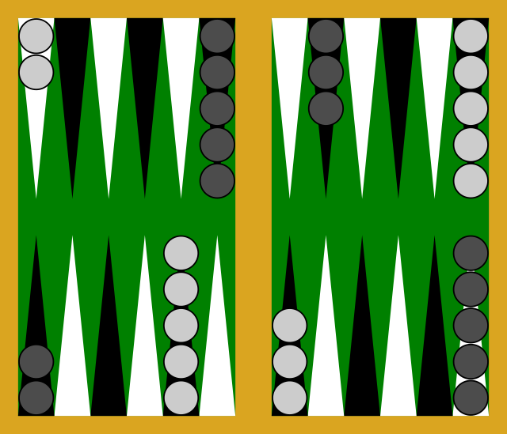
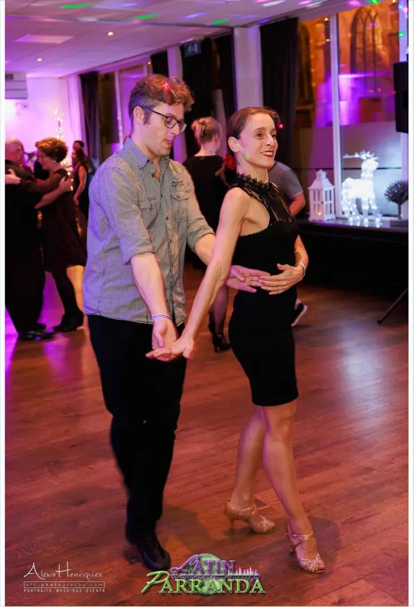
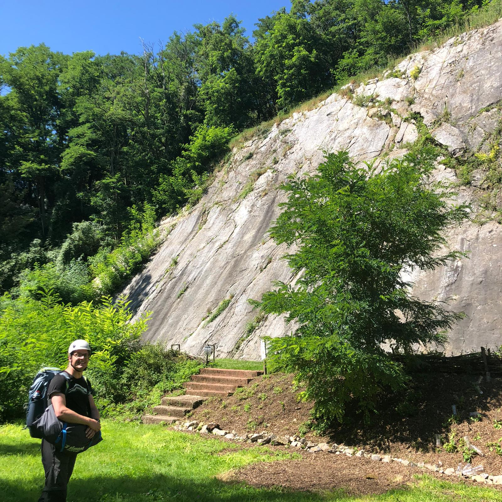
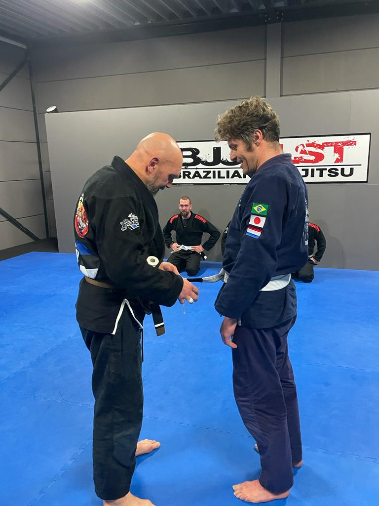

layout: true
class: middle, center

---

# Nature of ~~Code~~ Storytelling

---
<!-- Sun behind cloud  -->

# &#9925;

---
<!-- Mirror -->

# &#129694;

---
<!-- Listening -->
# &#128066;

---
<!-- Reading -->

# &#128218;

---
<!-- Thinking -->

# &#129300;

---
<!-- Rainbow -->

# &#127752;

---
<!-- Time -->

# &#128337;&#63;

---
<!-- Rat Race -->as

# &#128000;&#127937;

---
<!-- Searching Sparkles -->

# &#128270;&#10024;

---
<!-- Meditate -->

# &#129496;

---
<!-- Smell Roses -->

# &#128067;&#127801;

---
<!-- Shock Party -->

# &#128561;&#129395;

---
<!-- Map  Compass -->

# &#128506;&#129517;

---
name: introduction
background-image: url(https://fifth-postulate.nl/image/me.jpg)
background-position: center

---
template: introduction

.image.wide[]

---
template: introduction

.image.wide[]

---
template: introduction

.image.tall[]

---
template: introduction

.image.tall[]

---
template: introduction

.image.wide[]

---
template: introduction

.image.tall[]

